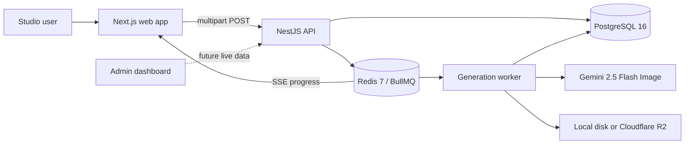

# Aluna — Product, Brand, and Design System

> Living source of truth for the product concept, experience, visual language, and technical
> foundation of Aluna.

**Document status:** Current implementation  
**Last updated:** July 2026  
**Product name:** Aluna°  
**Category:** AI fashion and product photography

---

## 1. Project summary

Aluna is an AI product-photo studio that turns one ordinary product image into a set of
campaign-ready marketing photographs.

The first and strongest use case is clothing: a seller uploads a clean flat-lay or packshot of a
garment, and Aluna generates believable on-model fashion photography. The product then expands into
cosmetics, perfume, footwear, food, furniture, electronics, and other categories that benefit from
professional product imagery.

The central promise is:

> **Change the world around the product, not the product itself.**

Aluna should preserve the source product’s shape, proportions, color, fabric or material, labels,
logos, artwork, printed text, stitching, hardware, and other brand-defining details. It changes the
model, setting, lighting, camera treatment, and mood while keeping the item recognizable and
commercially truthful.

The landing-page expression of that promise is:

> **One garment. Every world.**

### What Aluna replaces

Traditional product campaigns often require a photographer, studio, model, stylist, equipment,
retouching, scheduling, and repeated shoots for each new direction. Aluna compresses that workflow
into:

1. Upload one source product photo.
2. Choose a category and visual direction.
3. Generate several faithful campaign variants.
4. Review and export the results for product pages, paid ads, social, launches, and marketplaces.

### What Aluna is not

Aluna is not positioned as a novelty image generator. It is a directed commercial-production tool.
The image may be creative, but the product must remain accurate enough to market responsibly.

---

## 2. Product vision

Aluna’s long-term vision is to become a complete visual-production workspace for commerce teams: one
place to create, review, organize, and measure campaign assets generated from real products.

The product is built around four pillars:

### 2.1 Product truth

Fidelity is a functional requirement, not a decorative claim. Shape, materials, color, branding, and
printed information must stay as close to the source as the model permits.

### 2.2 One input, many worlds

A single source image should support several outputs: clean catalogue photography, on-model fashion,
editorial scenes, lifestyle settings, product launches, and social-first creative.

### 2.3 Directed results

Users should not need to become prompt engineers. Curated scene presets encode the lighting, camera,
composition, environment, and category-specific rules needed for a useful commercial result.

### 2.4 Campaigns, not isolated images

The end product is a coherent visual campaign. Multiple variants should be meaningfully different
while still feeling like part of the same brand direction.

---

## 3. Audience and use cases

### Primary users

- Independent fashion labels and direct-to-consumer brands.
- E-commerce teams that need frequent product-page and advertising assets.
- Social media and performance-marketing teams.
- Creative agencies producing many campaign variations.
- Marketplace sellers without access to a permanent studio.
- Cosmetics, skincare, makeup, and perfume brands.

### Lead scenarios

#### Clothing on a model

A user uploads a normal photo of a T-shirt. Aluna preserves its cut, color, fabric, seams, logo, and
print, then generates a young man or woman wearing it in a believable fashion campaign.

#### Perfume in a professional studio

A user uploads a phone photo of a perfume bottle on a countertop. Aluna removes the ordinary
background and rebuilds the scene as premium studio photography with controlled reflections, accurate
glass, legible labeling, and professional lighting.

#### Cosmetics and makeup marketing

A beauty brand uploads packaging or a product packshot. Aluna creates clean vanity, fresh-water, or
botanical campaign imagery and can use women models where a human beauty context improves the
marketing direction.

### Supported campaign outputs

- Product-detail pages.
- Paid social advertising.
- Organic social content.
- Campaign and product launches.
- Marketplace listings.
- Email and editorial imagery.

---

## 4. Current experience map

| Route                         | Purpose                                                 | Current state                                         |
| ----------------------------- | ------------------------------------------------------- | ----------------------------------------------------- |
| `/`                           | Public Aluna landing page                               | Implemented and interactive                           |
| `/studio/login`               | Creative workspace login                                | Demo form; no real authentication                     |
| `/studio`                     | Upload, scene, variants, preview, and results workspace | Interactive visual prototype; generation is simulated |
| `/admin/login`                | Operations dashboard login                              | Demo form; no real authentication                     |
| `/admin`                      | Metrics, queue health, spend, and generation activity   | Static visual prototype                               |
| `POST /generations`           | Upload and enqueue a generation job                     | Implemented in the NestJS API                         |
| `GET /generations/:id/events` | Stream queue and variant progress over SSE              | Implemented in the NestJS API                         |

The backend generation system is implemented, but the web Studio is not connected to it yet. The
current Studio uses local object URLs and timers to demonstrate the intended interaction. The Admin
dashboard uses illustrative metrics. Both login pages accept any valid email and a password of at
least four characters, then redirect locally.

There is currently no authentication, authorization, payment system, or real user account model. The
API uses the temporary user ID `user_demo`.

---

## 5. Landing-page strategy

The landing page is designed to make a technical AI capability feel like a premium creative studio.
It leads with a concrete fashion result, demonstrates proof through interactive comparisons, explains
the workflow, establishes fidelity as the differentiator, answers practical objections, and then
drives the visitor into the Studio login.

### Section order

1. **Navigation** — Aluna° wordmark, Before / After, Process, FAQ, and Enter studio.
2. **Hero** — “One garment. Every world.” with an on-model clothing campaign.
3. **Capability ticker** — Product pages, paid social, launches, and marketplaces.
4. **Before / after** — Interactive transformations for clothing and perfume.
5. **Selected directions** — Clothing, footwear, and cosmetics campaign examples.
6. **Process** — Bring the product, choose the world, build the campaign.
7. **Fidelity** — Shape, material, color, labels, and commercial-lighting principles.
8. **FAQ** — Six practical questions about models, fidelity, source quality, backgrounds, categories,
   and variants.
9. **Final CTA** — “Your next campaign starts with one photo.”
10. **Footer** — Product statement and separate Studio and Dashboard login links.

### Conversion logic

The page follows a proof-first sequence:

```text
Promise → Visual result → Before/after evidence → Range of directions
        → Simple process → Trust through fidelity → Objection handling → Studio CTA
```

Primary calls to action go to `/studio/login`. The Admin dashboard is intentionally kept out of the
primary navigation and is available from the footer through `/admin/login`.

---

## 6. Landing-page design concept

The visual direction combines a high-fashion editorial with a technical product-inspection system.

The fashion side appears through oversized typography, asymmetrical compositions, full-bleed campaign
photography, italic serif details, and dramatic studio color. The technical side appears through
numbering, small uppercase labels, scanning guides, fidelity annotations, before/after controls, and
precise one-pixel rules.

The result should feel:

- Premium but not exclusive or cold.
- Bold but still commercially credible.
- Creative without looking like a generic AI website.
- Editorial in composition and technical in its proof.
- Modern, tactile, and intentionally art-directed.

### Shape language

- Large images use one exaggerated lower-right corner.
- Buttons, labels, and tags use fully rounded pills.
- Most content containers remain square or nearly square.
- Fine one-pixel rules structure the page.
- Large soft shadows create photographic depth.
- Occasional hard offset shadows add a printed graphic quality.

Key radii:

| Element                    | Radius              |
| -------------------------- | ------------------- |
| Hero media                 | `3px 3px 150px 3px` |
| Before/after frames        | `3px 3px 100px 3px` |
| Buttons, tags, scan labels | `999px`             |
| Mobile hero media          | `3px 3px 90px 3px`  |
| Mobile comparisons         | `3px 3px 75px 3px`  |

---

## 7. Color system

The landing page owns a scoped palette through variables on `.aluna-site`.

### Core brand colors

| Token            | Value                    | Role                                       |
| ---------------- | ------------------------ | ------------------------------------------ |
| `--aluna-ink`    | `#11110f`                | Primary type, dark sections, footer        |
| `--aluna-paper`  | `#f3f0e8`                | Warm editorial page background             |
| `--aluna-violet` | `#6e47ff`                | Core brand violet                          |
| `--aluna-lime`   | `#d7ff43`                | CTAs, active states, labels, trust signals |
| `--aluna-line`   | `rgba(17, 17, 15, 0.18)` | Subtle rules on light surfaces             |

### Supporting colors

| Color              | Value     | Usage                                  |
| ------------------ | --------- | -------------------------------------- |
| White              | `#ffffff` | Hero text, light buttons, image labels |
| Hero black         | `#0e0d0f` | Start of the hero background           |
| Hero plum          | `#19131f` | Middle of the hero background          |
| Hero violet        | `#3a258b` | End of the hero background             |
| Frame charcoal     | `#252326` | Comparison fallback surface            |
| Sand               | `#d7d0c2` | Fidelity image field                   |
| Lavender           | `#b49cff` | Fidelity explanation panel             |
| CTA violet         | `#6948ff` | Final conversion section               |
| Deep orb violet    | `#1a0d46` | Final CTA orb shadow                   |
| Light orb lavender | `#f1e9ff` | Final CTA orb highlight                |

### Color behavior

- Lime is used sparingly. It identifies action, status, category, or proof.
- Violet carries creative energy and should dominate large campaign moments rather than body copy.
- Warm paper replaces pure white so the editorial sections feel tactile.
- Near-black replaces absolute black to avoid a sterile software aesthetic.
- Secondary copy uses opacity rather than additional gray tokens:
  approximately 48–70% on dark or light surfaces.
- Dividers generally use 13–28% opacity.

### Contrast pairings

- Lime on ink for high-energy promotional surfaces.
- Ink on lime for buttons and active tags.
- White on dark gradients for hero and process content.
- Ink on warm paper for long-form reading.
- Ink on lavender for the fidelity explanation.

---

## 8. Typography

No external font files, Google Fonts, `next/font`, or `@font-face` rules are currently used. This
keeps the site fast and gives it a deliberate system/editorial contrast.

### Font families

| Role                            | Stack                               |
| ------------------------------- | ----------------------------------- |
| Primary display and body        | `Arial, Helvetica, sans-serif`      |
| Editorial accent and navigation | `Georgia, "Times New Roman", serif` |

The sans-serif stack carries the product’s confidence and utility. Georgia introduces a fashion
editorial voice without requiring a downloaded font.

### Type roles

#### Wordmark

- Sans serif.
- Weight `900`.
- Tracking `-0.09em`.
- The degree symbol is smaller, raised, and lime.

#### Hero display

- `clamp(4.3rem, 7.8vw, 8.6rem)`.
- Weight `800`.
- Tracking `-0.09em`.
- Line height `0.82`.
- The highlighted phrase is lime; the final word uses the italic serif.

#### Section display

- Usually `clamp(3.6rem, 7vw, 8rem)`.
- Weight `800`.
- Tracking `-0.085em`.
- Line height `0.86`.
- Important emotional words use italic Georgia.

#### Final CTA display

- `clamp(4.2rem, 8vw, 9.4rem)`.
- Centered and intentionally oversized.

#### Labels and kickers

- Usually `0.62rem` to `0.8rem`.
- Weight `800` or `900`.
- Uppercase.
- Tracking `0.06em` to `0.15em`.

#### Body copy

- Usually around `1rem`.
- Line height `1.55` to `1.65`.
- Reduced opacity establishes hierarchy without adding more colors.

### Typography rules

- Use tight tracking only on large display text and the wordmark.
- Use generous tracking for small uppercase labels.
- Reserve italic serif for short editorial emphasis, not paragraphs.
- Headlines should be short enough to form strong two- or three-line blocks.
- Navigation and its CTA use Georgia in sentence case to feel more editorial and less like a generic
  software navbar.

---

## 9. Layout and spacing

### Global structure

- Minimum supported width: `320px`.
- Standard desktop gutter: `4vw`.
- Final CTA horizontal gutter: `5vw`.
- Major-section vertical padding:
  `clamp(100px, 12vw, 170px)` to `clamp(100px, 12vw, 180px)`.
- The layout uses asymmetric grids so the page feels art-directed rather than template-driven.

### Main grids

| Area             | Desktop grid                                          |
| ---------------- | ----------------------------------------------------- |
| Hero             | `0.92fr / 0.75fr`, with a minimum 470px visual column |
| Section headings | Approximately `0.45fr / 1.4fr / 0.65fr`               |
| Work gallery     | `1.3fr / 0.85fr`                                      |
| Process          | `0.85fr / 1.15fr`                                     |
| Fidelity         | `1.02fr / 0.98fr`                                     |
| FAQ              | `0.8fr / 1.2fr`                                       |

### Spacing principles

- Let imagery and display typography dominate; avoid card-heavy layouts.
- Use wide negative space to make generated images feel campaign-ready.
- Use rules and alignment, rather than boxes, to group related information.
- Repeat 20–45px gaps for local component rhythm.
- Use 65–180px gaps to separate narrative sections.
- Preserve the alternating comparison layout on desktop and normalize it into one reading order on
  mobile.

---

## 10. Image art direction

The landing page uses generated campaign photographs as product proof, not decorative stock imagery.
Every visible example should communicate a real input-to-output use case.

### Current landing assets

| Asset                        | Use                                             |
| ---------------------------- | ----------------------------------------------- |
| `aluna-shirt-model.png`      | Hero, clothing after image, clothing direction  |
| `aluna-shirt-before.png`     | Clothing source image                           |
| `aluna-perfume-before.png`   | Ordinary perfume source image                   |
| `aluna-perfume-studio.png`   | Perfume after image and fidelity section        |
| `aluna-sneaker-campaign.png` | Footwear campaign direction                     |
| `aluna-makeup-model.png`     | Cosmetics campaign direction with a woman model |
| `og-aluna-fashion.png`       | Open Graph and social-sharing image             |

`aluna-hero-serum.png` and `aluna-jewelry-campaign.png` remain in the asset folder but are not rendered
on the current landing page. Jewelry was deliberately replaced in the visible marketing mix by
cosmetics and makeup.

### Image principles

- Lead with clothing and on-model transformation.
- Show both men and women models across the wider campaign library.
- Use women models naturally for beauty, makeup, and fashion marketing contexts.
- Keep cosmetics and perfume packaging readable and unobstructed.
- Prefer believable commercial optics over surreal AI effects.
- Use real contact shadows, controlled highlights, and physically plausible materials.
- Avoid random props, excessive particles, floating products, invented logos, and illegible labels.
- Source and output images in a comparison must represent the same product.

### Rendering behavior

Landing images use native `` elements with `object-fit: cover`. Large crop-safe assets are
therefore important. The current fashion and perfume comparison images share a 4:5 portrait format;
the footwear and makeup examples provide variation in aspect ratio.

---

## 11. Motion and interaction system

Motion is built with GSAP 3 and `ScrollTrigger`, plus a small number of CSS transitions and keyframes.
It should feel cinematic and controlled, never playful or distracting.

### Intro timeline

| Element                       | Behavior                                                               |
| ----------------------------- | ---------------------------------------------------------------------- |
| Navigation                    | Moves from `y: -24`, fades in over `0.8s`                              |
| Eyebrow, title, copy, actions | Move from `y: 52`, fade over `0.95s`, stagger `0.1s`                   |
| Hero image                    | Reveals from a centered inset clip path and `scale: 0.92` over `1.25s` |
| Hero note                     | Moves from `y: 20`, fades over `0.65s`                                 |

The main easing is `power3.out`.

### Scroll behavior

- The hero image moves vertically by `10%` with a scrub value of `0.8`.
- Elements marked `data-reveal` rise `64px` and fade over `1s`.
- Work cards rise `90px`, fade, and receive a slight staggered rotation.
- The fidelity image scales from `1` to `1.08` across its scroll range.
- All entrance animations run only once.

### CSS interaction

- The lime capability ticker moves continuously over `24s`.
- Work images scale to `1.035` on hover over `700ms`.
- Buttons rise by 2–3px on hover.
- Work-card direction pills fade and slide into view.
- FAQ plus icons rotate 45 degrees when opened.
- The before/after control updates the output image’s clip path from an invisible range input.

### Motion rules

- Do not animate every element.
- Use motion to reveal hierarchy, demonstrate transformation, or reinforce depth.
- Prefer movement between 20px and 90px.
- Keep micro-interactions around 180–280ms.
- Keep cinematic image movement around 700–1250ms.
- Never block interaction while an entrance animation is running.

### Reduced motion

The implementation checks `prefers-reduced-motion: reduce`. In that mode:

- GSAP intro and scroll animations are bypassed.
- The ticker stops.
- CSS transitions are reduced to nearly zero duration.
- Normal reading and interaction remain available.

---

## 12. Responsive system

### Up to 1100px

- Central navigation links are hidden; the wordmark and Studio CTA remain.
- The hero uses a tighter two-column grid.
- Three-column section introductions collapse to two columns.
- Process and FAQ become single-column layouts.
- Sticky section introductions become static.

### Up to 760px

- Navigation height changes from 86px to 72px.
- Page gutters become 20px.
- The hero stacks vertically.
- The decorative hero divider and image note are hidden.
- Hero type becomes `clamp(3.8rem, 18vw, 6rem)`.
- Major sections use `95px 20px`.
- Comparisons, work directions, process, fidelity, and footer all stack.
- Work images use a tall portrait presentation.
- The final CTA’s orb shrinks from 720px to 520px.
- Reversed desktop comparisons return to a natural image-then-copy order.

### Responsive principle

Mobile is not a compressed desktop layout. It maintains the same editorial hierarchy but changes the
reading order, image proportions, sticky behavior, and density to make each section work as a vertical
story.

---

## 13. Accessibility

The current landing includes:

- Semantic header, navigation, sections, articles, headings, and footer.
- Descriptive image alternative text.
- An accessible label on each before/after range input.
- A visible lime focus outline around comparison frames.
- Native `<details>` and `<summary>` controls for FAQ content.
- Reduced-motion support.
- Text labels in addition to color-based state.

Future work should include:

- A full keyboard and screen-reader pass on every route.
- Automated contrast checks for low-opacity secondary copy.
- Consistent `:focus-visible` styles for all links and buttons.
- Optimized responsive image delivery.
- Live-region announcements for actual Studio generation progress and errors.

---

## 14. Brand voice and content rules

Aluna writes like an experienced creative director who understands e-commerce production.

### Voice

- Direct.
- Assured.
- Visually literate.
- Specific about product accuracy.
- Optimistic without exaggerating AI capabilities.

### Preferred language

- “Campaign-ready.”
- “One source photo.”
- “On-model.”
- “Directed scene.”
- “Product fidelity.”
- “Shape, color, materials, labels.”
- “Professional studio lighting.”

### Avoid

- Generic claims such as “revolutionary” or “magical.”
- Promising perfect accuracy.
- Treating AI as the visual hero; the customer’s product is the hero.
- Dense technical language on the marketing page.
- Jewelry-led positioning; clothing and cosmetics are the public lead categories.
- Decorative arrows inside primary buttons. Text links may communicate direction through layout and
  hover treatment without appending arrow glyphs.

---

## 15. Studio experience

The Studio is the creative production workspace.

### Intended workflow

1. Upload or drop a PNG, JPG, or WebP source image.
2. Select a product category.
3. Choose an appropriate scene preset.
4. Select 1–8 variants.
5. Generate and watch progress:
   `queued → analyzing → generating → variant complete → done`.
6. Review the result grid.
7. Download one result or the complete campaign set.

### Current implementation

The page currently supports local image selection, preview, category selection, three visual scene
choices, variant count, simulated progress, and a simulated result grid. It does not call the API.

The visible Studio scenes are currently generic:

- Soft Studio.
- Golden Hour.
- Color Story.

These UI choices need to be mapped to the backend’s category-specific preset IDs before integration.
The Studio also still exposes Jewelry as a category even though it is no longer a lead landing-page
story.

### Integration target

The next functional step is:

1. Send the selected file and options to `POST /generations`.
2. Subscribe to the returned SSE events URL with `EventSource`.
3. Translate backend events into the existing progress UI.
4. Resolve local storage keys or R2 URLs into visible result images.
5. Add retry, cancel, upload, generation, and network error states.

---

## 16. Admin dashboard

The Admin dashboard represents the operations side of Aluna.

Its current design includes:

- Images generated.
- Active campaigns.
- Average generation time.
- Estimated spend.
- Generation-volume chart.
- Queue health.
- Worker count.
- Recent generation runs.
- Status, cost, and duration per run.

The values are static design data. Future implementation should read from Prisma, BullMQ, and storage
through protected API endpoints. Admin access must eventually be authorized separately from normal
Studio access.

---

## 17. Technical architecture

Aluna is a pnpm workspace monorepo.



### Stack

| Layer                  | Technology                                                      |
| ---------------------- | --------------------------------------------------------------- |
| Monorepo               | pnpm 10 workspaces                                              |
| Web                    | Next.js 15.5, App Router, React 19, strict TypeScript           |
| Styling                | Tailwind CSS 3 installed; bespoke CSS drives current interfaces |
| Motion                 | GSAP 3 with ScrollTrigger                                       |
| API                    | NestJS 11, strict TypeScript                                    |
| AI                     | Google Gemini `gemini-2.5-flash-image`                          |
| Queue                  | BullMQ 5                                                        |
| Cache/queue transport  | Redis 7                                                         |
| Database               | PostgreSQL 16                                                   |
| ORM                    | Prisma 6                                                        |
| Object storage         | Cloudflare R2 through the AWS S3 SDK                            |
| Local infrastructure   | Docker Compose                                                  |
| Validation             | Joi environment validation and class-validator DTOs             |
| Formatting and linting | Prettier and ESLint                                             |

### Repository map

```text
.
├── apps/
│   ├── api/
│   │   ├── prisma/
│   │   │   ├── migrations/
│   │   │   └── schema.prisma
│   │   └── src/
│   │       ├── cli/
│   │       ├── config/
│   │       ├── generation/
│   │       ├── generations/
│   │       ├── prisma/
│   │       └── storage/
│   └── web/
│       ├── app/
│       │   ├── admin/
│       │   ├── components/
│       │   ├── studio/
│       │   ├── globals.css
│       │   ├── layout.tsx
│       │   └── page.tsx
│       └── public/images/
├── docker-compose.yml
├── package.json
├── pnpm-workspace.yaml
├── PROMPTING.md
└── README.md
```

---

## 18. Generation engine

The generation engine lives in `apps/api/src/generation`.

### Model request

Each variant is a separate request to:

```text
gemini-2.5-flash-image
```

The request contains:

- The input product image as inline base64 data.
- A composed category-and-scene prompt.
- The shared product-fidelity block.
- A variant instruction that requests a meaningfully different composition.
- Image-only response modality.

### Fidelity block

Every scene includes a typed `{FIDELITY_BLOCK}` slot. The shared block instructs Gemini to preserve:

- Silhouette and proportions.
- Construction and surface finish.
- Colors and materials.
- Stitching, hardware, and packaging geometry.
- Logos, labels, typography, and printed text.
- Brand-mark spelling, position, and shape.

It also requires photorealism, realistic optics, natural contact shadows, accurate reflections,
professional lighting, and no invented or distorted brand elements.

### Preset matrix

| Category    | Scene 1                     | Scene 2                    | Scene 3                           |
| ----------- | --------------------------- | -------------------------- | --------------------------------- |
| Clothing    | `studio` — Editorial Studio | `street` — Modern Street   | `detail` — Material Detail        |
| Cosmetics   | `vanity` — Luxury Vanity    | `water` — Fresh Water      | `botanical` — Botanical Editorial |
| Food        | `table` — Appetizing Table  | `kitchen` — Bright Kitchen | `graphic` — Bold Color            |
| Jewelry     | `velvet` — Velvet Gallery   | `marble` — Sunlit Marble   | `evening` — Evening Glow          |
| Furniture   | `loft` — Architectural Loft | `minimal` — Minimal Studio | `home` — Lived-in Home            |
| Electronics | `tech` — Precision Tech     | `desk` — Creative Desk     | `dynamic` — Dynamic Launch        |

The public marketing strategy can prioritize clothing and cosmetics without removing supported
backend categories.

Prompt editing and experiment logging are documented separately in `PROMPTING.md`.

### Cost and timing

The service records:

- Duration per variant.
- Estimated cost per variant.
- Cumulative output keys.
- Total run duration.
- Total estimated cost.
- Failure details.

The default estimate is:

- `$0.039` per output image.
- `$0.30` per million input tokens.

These are configurable estimates, not billing records.

---

## 19. Standalone CLI

Prompt quality can be tested without the HTTP or queue layer:

```bash
pnpm generate --image ./test.jpg --category clothing --scene studio --variants 4
```

The CLI:

- Accepts 1–8 variants.
- Validates category, scene, file presence, and image MIME type.
- Requires `GEMINI_API_KEY`.
- Uses the same generation service as the API.
- Stores outputs through the same local/R2 storage layer.
- Records the run in PostgreSQL.
- Prints output keys, duration, and estimated cost.

Although it avoids HTTP and Redis, it still requires Gemini credentials and a working PostgreSQL
connection because run logging is part of the generation service.

Use the following to list valid category and scene combinations:

```bash
pnpm generate --help
```

---

## 20. Queue and API pipeline

### Create a generation

```http
POST /generations
Content-Type: multipart/form-data
```

Fields:

| Field      | Type    | Notes                                |
| ---------- | ------- | ------------------------------------ |
| `image`    | File    | Image only, maximum 15 MB            |
| `category` | String  | One of the configured categories     |
| `sceneId`  | String  | Must belong to the selected category |
| `variants` | Integer | 1–8                                  |

The endpoint stores the input, creates a `QUEUED` database row, adds the BullMQ job, and returns:

```json
{
  "id": "generation-id",
  "status": "queued",
  "eventsUrl": "/generations/generation-id/events"
}
```

### Event stream

```http
GET /generations/:id/events
Accept: text/event-stream
```

The intended lifecycle is:

```text
queued → analyzing → generating → variant-complete → done
                                              └────→ failed
```

The worker processes two jobs concurrently. Jobs receive two total attempts with exponential backoff.

### Current API limitations

- There is no dedicated generation-detail endpoint.
- There is no download endpoint.
- API responses expose storage keys, not resolved public URLs.
- CORS is not configured.
- No authentication protects the API.
- There are no automated integration or end-to-end tests yet.

---

## 21. Persistence and storage

### Generation model

Prisma maps `Generation` to the `generation_runs` table.

| Field          | Purpose                                                  |
| -------------- | -------------------------------------------------------- |
| `id`           | Generation/run identifier                                |
| `userId`       | Temporary hardcoded user, default `user_demo`            |
| `status`       | `QUEUED`, `ANALYZING`, `GENERATING`, `DONE`, or `FAILED` |
| `category`     | Product category                                         |
| `sceneId`      | Selected prompt preset                                   |
| `inputKey`     | Local or R2 source-object key                            |
| `outputKeys[]` | Generated result keys                                    |
| `costUsd`      | Estimated cumulative generation cost                     |
| `durationMs`   | Total elapsed time                                       |
| `error`        | Failure description                                      |
| `createdAt`    | Creation timestamp                                       |
| `updatedAt`    | Last update timestamp                                    |

Indexes exist on status and creation time.

### Storage behavior

When all core R2 variables are configured, Aluna stores inputs and outputs in Cloudflare R2 through
its S3-compatible endpoint. When any required R2 variable is absent, it safely falls back to local
disk under `apps/api/output` when the API is run from that package.

Typical keys:

```text
inputs/{generationId}/source-{hash}.{ext}
generations/{generationId}/variant-01.png
{cli-timestamp}/variant-01.png
```

---

## 22. Environment configuration

The API reads `apps/api/.env` and validates configuration with Joi.

| Variable                                   | Required | Default / purpose             |
| ------------------------------------------ | -------- | ----------------------------- |
| `GEMINI_API_KEY`                           | Yes      | Google Gemini API credential  |
| `DATABASE_URL`                             | Yes      | PostgreSQL connection string  |
| `PORT`                                     | No       | `3001`                        |
| `REDIS_URL`                                | No       | `redis://localhost:6379`      |
| `GEMINI_IMAGE_OUTPUT_COST_USD`             | No       | `0.039`                       |
| `GEMINI_INPUT_COST_PER_MILLION_TOKENS_USD` | No       | `0.3`                         |
| `R2_ACCOUNT_ID`                            | No       | Cloudflare account ID         |
| `R2_ACCESS_KEY_ID`                         | No       | R2 access key                 |
| `R2_SECRET_ACCESS_KEY`                     | No       | R2 secret                     |
| `R2_BUCKET`                                | No       | R2 bucket                     |
| `R2_PUBLIC_BASE_URL`                       | No       | Optional public/custom domain |
| `NEXT_PUBLIC_APP_URL`                      | No       | Web metadata base URL         |

The application fails with a clear message when `GEMINI_API_KEY` is missing.

---

## 23. Local development

### Prerequisites

- Node.js 22 or newer.
- pnpm 10 or newer.
- Docker with Compose.
- A Gemini API key.

### Setup

```bash
pnpm install
docker compose up -d
```

Copy the example environment file:

```bash
cp apps/api/.env.example apps/api/.env
```

Set `GEMINI_API_KEY`, then initialize Prisma:

```bash
pnpm db:generate
pnpm db:migrate
```

### Run both apps

```bash
pnpm dev
```

Default local addresses:

- Web: `http://localhost:3000`
- API: `http://localhost:3001`
- PostgreSQL: `localhost:5432`
- Redis: `localhost:6379`

### Quality checks

```bash
pnpm build
pnpm lint
pnpm format:check
```

---

## 24. Development priorities

### Priority 1 — connect Studio to the real pipeline

- Add a public web API-base environment variable.
- Enable appropriately restricted CORS in NestJS.
- Map UI categories and scene IDs to `styles.config.ts`.
- Submit multipart uploads from the Studio.
- Connect SSE progress to the existing status UI.
- Return usable local or R2 image URLs.
- Replace simulated results with generated outputs.

### Priority 2 — make result retrieval complete

- Add `GET /generations/:id`.
- Add signed or public output URLs.
- Add per-image and campaign download behavior.
- Support reconnecting to an in-progress generation.
- Add retry and meaningful error recovery.

### Priority 3 — make Admin real

- Expose aggregate generation, spend, duration, queue, and error metrics.
- Connect recent runs to Prisma.
- Connect queue health to BullMQ.
- Add filtering and pagination.

### Priority 4 — add identity and access

- Replace demo logins with authentication.
- Separate Studio and Admin permissions.
- Replace `user_demo` with real ownership.
- Protect storage and generation endpoints.

### Priority 5 — harden production quality

- Add unit, API integration, queue, and browser end-to-end tests.
- Validate image dimensions and formats.
- Add rate limits, quotas, abuse controls, and observability.
- Track actual provider usage alongside cost estimates.
- Optimize web images and split the large global stylesheet into maintainable layers.

---

## 25. Rules for extending the design

When adding a landing-page section or campaign example:

1. Start from a clear product or conversion question.
2. Use an existing design token before adding a color.
3. Use the Arial/Georgia contrast instead of introducing another font.
4. Prefer full-bleed media, rules, and whitespace over generic rounded cards.
5. Keep lime for action, proof, and state.
6. Keep violet for high-impact creative surfaces.
7. Add motion only when it clarifies hierarchy or transformation.
8. Support reduced motion.
9. Verify tablet and mobile layouts at both established breakpoints.
10. Make every example support the fidelity story.

When adding a scene preset:

1. Keep the shared fidelity slot exactly once.
2. Describe environment, placement, lighting, camera, composition, and exclusions.
3. Avoid inventing product ingredients, features, branding, or claims.
4. Keep the preset category-specific.
5. Test several source qualities and log findings in `PROMPTING.md`.

---

## 26. Definition of success

Aluna succeeds when a prospective customer can understand the product in seconds, trust that their
garment or packaging will stay recognizable, and move naturally from a convincing before/after result
into a functional generation workflow.

The experience should always make three things clear:

1. **The input can be simple.**
2. **The output can look like a real campaign.**
3. **The product must remain the same product.**
