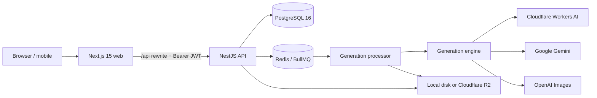
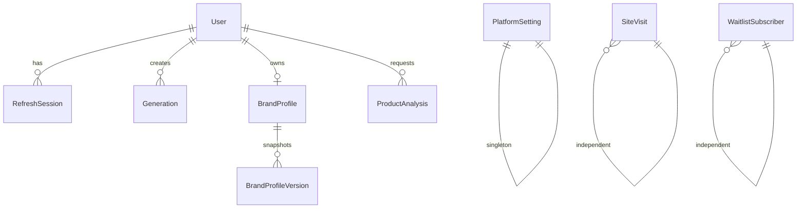
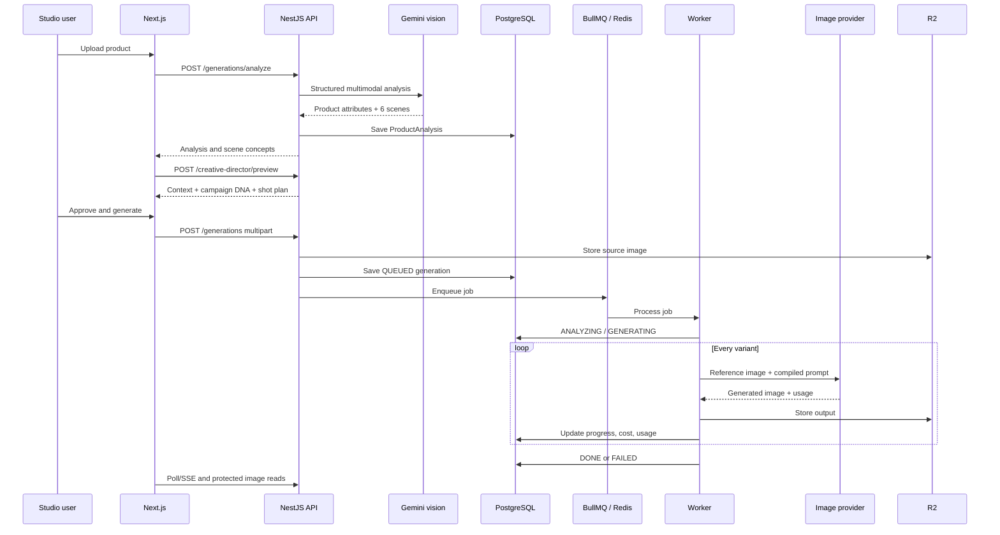

# Aluna — Technical architecture and implementation guide

This document describes the application that is currently in this repository: frontend, backend,
database, queue, storage, design system, security, AI providers, and the conventions for extending
each layer.

## 1. System overview

Aluna is a pnpm workspace monorepo with two applications and four runtime dependencies.



| Layer                 | Current technology                                             | Responsibility                                                                  |
| --------------------- | -------------------------------------------------------------- | ------------------------------------------------------------------------------- |
| Monorepo              | pnpm 10 workspaces                                             | Dependency installation and commands across applications                        |
| Web                   | Next.js 15 App Router, React 19, TypeScript                    | Landing page, Studio, Super Admin dashboard, login flows                        |
| Styling               | Tailwind base plus a repository-wide CSS design system         | Responsive layouts, tokens, components, animation                               |
| Motion                | GSAP                                                           | Landing-page motion and scroll effects                                          |
| Icons                 | Lucide React                                                   | Consistent interface iconography                                                |
| API                   | NestJS 11, TypeScript                                          | Validation, authentication, policies, business logic, streaming, administration |
| ORM                   | Prisma 6                                                       | Typed database access and SQL migrations                                        |
| Primary data          | PostgreSQL 16                                                  | Users, sessions, campaigns, analysis, brand memory, analytics, settings         |
| Queue                 | BullMQ                                                         | Durable generation jobs, retries, progress events                               |
| Queue data            | Redis 7 locally; Redis/Valkey-compatible service in production | Waiting, active, delayed, failed, and completed jobs                            |
| Object storage        | Cloudflare R2 through the AWS S3 SDK                           | Private source photos, outputs, and brand logos                                 |
| Local object fallback | `apps/api/output/`                                             | Development when R2 is incomplete or absent                                     |
| Image processing      | Sharp                                                          | Orientation, resizing, format conversion, provider constraints                  |
| AI                    | Cloudflare, Gemini, or OpenAI                                  | Multimodal product understanding and reference-image generation                 |

## 2. Repository structure

```text
/
├─ apps/
│  ├─ web/
│  │  ├─ app/                 Next.js routes, components and global design system
│  │  ├─ public/              Landing and login media
│  │  ├─ next.config.ts       Same-origin API rewrite
│  │  └─ vercel.json          Vercel framework declaration
│  └─ api/
│     ├─ prisma/
│     │  ├─ schema.prisma     Canonical data model
│     │  └─ migrations/       Checked-in SQL history
│     ├─ src/                 NestJS domain modules
│     ├─ test/                No-cost system and Creative Director smoke tests
│     └─ output/              Ignored local object storage
├─ docker-compose.yml         Local PostgreSQL 16 and Redis 7
├─ render.yaml                Render API, Postgres, and Key Value Blueprint
├─ railway.json               Alternative Railway API deployment
├─ pnpm-workspace.yaml
└─ package.json
```

## 3. Frontend architecture

### Routes

| Route                | Purpose                                                   |
| -------------------- | --------------------------------------------------------- |
| `/`                  | Public Aluna landing page and waiting-list entry          |
| `/studio/login`      | Customer authentication                                   |
| `/studio`            | Private customer workspace                                |
| `/admin/login`       | Super Admin authentication                                |
| `/admin`             | Admin overview                                            |
| `/admin/traffic`     | Site traffic analytics                                    |
| `/admin/usage`       | Cost, units, category, provider, and customer consumption |
| `/admin/generations` | Searchable generation audit ledger                        |
| `/admin/users`       | Customer account and quota management                     |
| `/admin/waitlist`    | Waiting-list CRM                                          |
| `/admin/system`      | Queue, storage, provider, budget, and model health        |
| `/admin/api-keys`    | Write-only provider vault status and configuration        |

Admin pages use real URL segments through `apps/web/app/admin/[section]/page.tsx`, so a hard refresh
keeps the selected section. The Studio currently uses one authenticated page with internal section
state.

### API access

The browser uses `authFetch()` from `apps/web/app/lib/auth-client.ts`. In production, requests should
go to the same Vercel origin under `/api`. Next.js rewrites those requests to the private value of
`ALUNA_API_ORIGIN`; therefore no public API hostname needs to be embedded in the browser bundle.

Current session behavior:

- the access and refresh tokens are stored in `localStorage` when “Remember me” is selected;
- otherwise they are stored in `sessionStorage`;
- an expired access token triggers one refresh request and one retry;
- login revokes any previous active session for the same account;
- Studio and Admin gates call `/auth/me` before rendering private content.

### Studio flow

The current create screen follows this sequence:

1. Upload and locally preview an image.
2. Optionally call `POST /generations/analyze` for multimodal product analysis.
3. Select a fixed preset or one of the product-specific scene concepts.
4. Configure category controls and, for clothing, adult model/casting controls.
5. Review `POST /creative-director/preview` as a visible Intelligent Creative Director plan.
6. Submit `POST /generations` as multipart form data.
7. Poll the protected generation record while the server also exposes SSE events.
8. Fetch private image bytes through authenticated asset endpoints.

### Languages

The public and login experience includes English, French, and Moroccan Arabic/Darija presentation.
Arabic switches the document direction and uses Tajawal. English and French use Clarity City.
Business data is not translated automatically; copy is maintained in the frontend.

## 4. Design system

The design system is implemented in `apps/web/app/globals.css` and imported once by the root layout.
Tailwind provides normalization and utilities, but the main surfaces use explicit component classes.

### Typography

| Use                                    | Family                                                      |
| -------------------------------------- | ----------------------------------------------------------- |
| Main interface, landing, Studio, Admin | Clarity City, falling back to Helvetica Neue and sans-serif |
| Arabic/Darija                          | Tajawal                                                     |
| Selected editorial display moments     | Georgia / Times New Roman fallback stack                    |

Font packages are imported in `apps/web/app/layout.tsx`, avoiding external font-host dependencies.

### Color systems

The product intentionally gives every surface a related but distinct identity.

| Surface | Primary feeling               | Main tokens                                                              |
| ------- | ----------------------------- | ------------------------------------------------------------------------ |
| Landing | Editorial, bold, campaign-led | ink `#11110f`, paper `#f3f0e8`, violet `#6e47ff`, lime `#d7ff43`         |
| Studio  | Calm production workspace     | ink `#171814`, paper `#f5f5f0`, lime `#d8ff47`, violet accents           |
| Admin   | Operational and analytical    | ink `#17131f`, paper `#f6f3fb`, primary `#7556f2`, soft violet `#eee9ff` |

### Component principles

- Clarity before decoration: every card has one operational purpose.
- Purple belongs primarily to system intelligence and administration.
- Lime belongs to creation, success, and key Studio actions.
- Lucide icons replace emoji and inconsistent symbols.
- Tables gain search, sort, filters, status badges, empty states, and confirmation dialogs.
- Destructive operations require a confirmation dialog.
- Mobile layouts collapse grids rather than shrinking desktop controls beyond usability.
- Generated media uses authenticated endpoints; source and output objects are not assumed public.

### How to create a new frontend page

1. Add `apps/web/app/<route>/page.tsx` or a dynamic route folder.
2. Use a client component only when state, browser APIs, or event handlers are required.
3. Fetch protected data through `authFetch()`, not a direct provider URL.
4. Reuse the appropriate shell: public, Studio, or `AdminGate`.
5. Add semantic headings, labels, keyboard-accessible buttons, and useful loading/error/empty states.
6. Add component styles under the matching CSS namespace (`aluna-`, `studio-`, or `ops-`).
7. Verify at desktop, 680 px, and 420 px breakpoints.
8. Run `pnpm --filter @product-photo/web lint` and `pnpm --filter @product-photo/web build`.

## 5. Backend architecture

### NestJS modules

| Module                   | Responsibility                                                                         |
| ------------------------ | -------------------------------------------------------------------------------------- |
| `AuthModule`             | Login, refresh rotation, logout, current user, global auth and permission guards       |
| `UsersModule`            | Super Admin account creation, edit, password reset, limits, bans, activation, deletion |
| `BrandProfileModule`     | Versioned brand identity and private logo storage                                      |
| `ProductAnalysisModule`  | Gemini image understanding and product-specific scene proposals                        |
| `CreativeDirectorModule` | Context routing, campaign DNA, shot planning, fingerprints, prompt compilation         |
| `GenerationModule`       | Provider selection, model adapters, prompt assembly, costs, budgets, image processing  |
| `GenerationsModule`      | Upload API, policies, persistence, BullMQ queue, worker, status and SSE                |
| `StorageModule`          | Private local/R2 object reads and writes                                               |
| `AdminModule`            | Overview, audit, provider/model selection, credential vault, waiting list              |
| `AnalyticsModule`        | Privacy-safe site-visit collection and reporting                                       |
| `WaitlistModule`         | Public idempotent waiting-list capture                                                 |
| `PrismaModule`           | Shared database client                                                                 |

`ConfigModule` validates all environment variables at startup with Joi. A global `ValidationPipe`
transforms DTO values, strips nothing silently, and rejects fields that are not explicitly allowed.

### Important endpoint groups

```text
Public
  GET  /health
  POST /analytics/visits
  POST /waitlist
  POST /auth/login
  POST /auth/refresh
  POST /auth/logout

Authenticated Studio
  GET/PATCH      /brand-profile
  POST/GET       /brand-profile/logo
  POST           /generations/analyze
  POST           /creative-director/preview
  GET            /generations/presets
  GET            /generations/configuration
  GET/POST       /generations
  GET            /generations/:id
  GET            /generations/:id/input
  GET            /generations/:id/results/:index
  GET (SSE)      /generations/:id/events

Super Admin
  GET/POST/PATCH/DELETE /users...
  GET                   /admin/overview
  GET                   /admin/generations
  GET/PATCH/DELETE      /admin/waitlist...
  PATCH                 /admin/generation-provider
  PATCH                 /admin/generation-model
  GET/PATCH             /admin/provider-credentials
```

### How to create a new backend domain

1. Create `apps/api/src/<domain>/<domain>.module.ts`.
2. Put request contracts in `dto/` and use `class-validator` on every external field.
3. Keep HTTP concerns in the controller and business rules in the service.
4. Add permissions with `@Permissions(...)`; mark only genuinely public operations with `@Public()`.
5. Register the module in `AppModule` or import it into the owning domain module.
6. Add database access through `PrismaService`, not ad-hoc SQL clients.
7. Return stable response shapes that do not include internal hashes, encrypted secrets, or storage
   credentials.
8. Add a smoke-test case, then run API lint and build.

## 6. Database design

The canonical schema is `apps/api/prisma/schema.prisma`. PostgreSQL table names are mapped to
snake_case; TypeScript uses Prisma model names.

### Relationship map



### Table catalogue

#### `users`

One record per human account. Roles are deliberately only `SUPER_ADMIN` and `USER`.

Key fields: unique email, display name, bcrypt password hash, role, active state, timed ban and
reason, hourly and daily request limits, per-request variant limit, concurrent-request limit, login
activity, and timestamps.

#### `refresh_sessions`

One rotating server-side session record. Only a SHA-256 hash of the refresh token is stored. Login
revokes earlier sessions, enforcing one active device/browser per account.

#### `brand_profiles`

One current Brand Profile per user. It contains business identity, audience, positioning, markets,
languages, slogan, palette, typography, visual preferences, restrictions, defaults, logo metadata,
onboarding state, and current version.

#### `brand_profile_versions`

Immutable JSON snapshots of every Brand Profile version. The unique pair of profile ID and version
prevents duplicate version numbers.

#### `product_analyses`

Structured output of the multimodal analyst: source key, category, product type/class, summary,
confidence, visible/physical attributes, six scene concepts, model, estimated analysis cost, and
timestamp.

#### `generation_runs`

The central audit table. It records user and immutable owner snapshot, status, provider/model,
quality/size, product context, Brand Profile snapshot/version, Creative Director plan and
fingerprint, source/output keys, requested variants, provider usage, token details, estimated cost,
duration, classified error, and timestamps.

The user relation uses `onDelete: SetNull` so an administrator can delete a user without destroying
the financial and operational generation audit.

#### `platform_settings`

A singleton record (`id = main`) for the active provider, encrypted provider credential overrides,
masked credential metadata, and one selected model per provider.

#### `site_visits`

First-party traffic events: path, anonymous visitor ID, referrer, optional country, device category,
and timestamp. It does not store raw IP addresses.

#### `waitlist_subscribers`

Unique optional email/phone records with locale, source, offer, pipeline status, private notes,
contact time, and timestamps.

### How to create or change a table

1. Edit `apps/api/prisma/schema.prisma`.
2. Choose delete behavior explicitly for every relation.
3. Add indexes for frequent filters and sorts; do not index every field without evidence.
4. Locally run:

   ```bash
   pnpm --filter @product-photo/api prisma:migrate --name describe_the_change
   pnpm db:generate
   ```

5. Review the generated SQL in `apps/api/prisma/migrations/` before applying it elsewhere.
6. Update services, DTOs, serializers, admin reporting, tests, and documentation.
7. Commit the schema and generated migration together.
8. Production runs `prisma migrate deploy`; never run development migration creation against the
   production database.

For important production changes, make a database backup before deployment and test migration and
rollback behavior on a copy.

## 7. Generation pipeline



The worker concurrency is currently one. A job retries once with exponential backoff. Every variant
is a separate provider request, allowing progress and cost to be recorded incrementally.

## 8. AI architecture

### Layer A — Product Analyst

`POST /generations/analyze` sends a resized copy of the source image to the configured Gemini vision
model. The model must return validated JSON containing:

- category, product type/class, summary, and confidence;
- materials, dominant colors, finish, geometry/scale, and visible text;
- handling notes and forbidden environments;
- exactly six product-specific scene concepts with environment, light, camera, props, and mood.

The current default configured in the repository is `gemini-3.6-flash`. Availability must be checked
in the target Google project before deployment; the environment variable can change it without a
code change.

### Layer B — Intelligent Creative Director

This layer is provider-independent. It merges:

1. exact product analysis;
2. the saved Brand Profile and its version;
3. safety and commercial context rules;
4. user category, scene, brief, and detailed controls;
5. variation count and historical uniqueness index.

It produces product context, an effective category/scene, warnings, campaign DNA, a distinct shot
plan for every variant, a semantic fingerprint, and a compiled direction prompt. An incoherent
selection can be corrected before a paid image request.

### Layer C — Image execution providers

Only models that accept a reference image and return an edited/generated image belong in the model
catalogue.

| Provider              | Models currently represented in code                           | Role                                                                           |
| --------------------- | -------------------------------------------------------------- | ------------------------------------------------------------------------------ |
| Cloudflare Workers AI | `@cf/black-forest-labs/flux-2-klein-9b`                        | Low-cost demo and fast image editing; usage tracked in neurons                 |
| Google Gemini         | `gemini-2.5-flash-image`, Nano Banana 2 Lite/2/Pro identifiers | Product-image generation with higher-fidelity options; usage tracked in tokens |
| OpenAI                | `gpt-image-2`, `gpt-image-1`                                   | Alternative image-editing provider; usage and estimated output cost stored     |

Model names and pricing change. Treat the catalogue descriptions and cost constants as operational
estimates, confirm identifiers in the provider account, and update them before relying on billing
reports.

### Prompt assembly order

1. Immutable fidelity contract.
2. Brand intelligence and prohibited elements.
3. Product truth and physical constraints.
4. Safety and commercial context.
5. Effective scene preset or analyzed scene.
6. Campaign DNA and variant-specific shot role.
7. Customer brief and creative controls.
8. Provider-specific formatting.

Lower-priority creative instructions must never override product fidelity or visible brand facts.

### How to add a new scene preset

1. Add typed prompt content to `apps/api/src/generation/styles.config.ts`.
2. Keep the shared fidelity block in the composed prompt.
3. Add or reuse option definitions in `campaign-options.config.ts`.
4. Ensure the category/scene is returned by `/generations/presets`.
5. Add it to CLI help and smoke-test coverage.
6. Record prompt experiments in `PROMPTING.md`.

### How to add a model to an existing provider

1. Confirm that the provider model accepts an input/reference image and returns image output.
2. Add it to `PROVIDER_MODEL_CATALOG` with a conservative cost estimate.
3. Confirm the existing provider adapter supports the model's request and response format.
4. Expose selection only after its credential status is configured.
5. Test one low-cost image, moderation failure, timeout, malformed output, and usage recording.
6. Update the Admin description and this document.

### How to add a new AI provider

1. Extend the `GenerationProvider` type and environment validation.
2. Create a server-side adapter that accepts the normalized source and compiled prompt.
3. Implement configuration detection, model catalogue, cost and usage normalization, and error
   classification.
4. Add encrypted credential fields and masked metadata—never return plaintext keys.
5. Add provider/model selection to Admin and freeze provider/model into each queued generation.
6. Add daily cost protection and a no-cost test double or malformed-input test path.
7. Verify that queued jobs continue to use their original provider even if the global selection
   changes later.

## 9. Security model

### Implemented controls

- Passwords are hashed with bcrypt, cost factor 12.
- Access JWTs are short-lived; refresh JWTs rotate on every refresh.
- Refresh tokens are stored only as SHA-256 hashes.
- Every protected request checks both the JWT and its live server-side session.
- New login revokes older sessions for the same user.
- Deactivated and currently banned users are rejected at login and on protected requests.
- Role-to-permission mapping separates one Super Admin from customer users.
- Customer generation and asset reads are scoped to the authenticated user unless the role can read
  all operations.
- DTO whitelist validation rejects unexpected request fields.
- Upload size and MIME-family checks are enforced server-side.
- CORS uses an explicit comma-separated origin allowlist.
- Provider credentials entered in Admin are encrypted with AES-256-GCM using a key derived from
  `JWT_ACCESS_SECRET`; only configured state, source, and final four characters return to the UI.
- R2 and AI credentials stay in the API process, never in `NEXT_PUBLIC_*` variables.
- Per-user hourly, daily, per-request variant, and concurrent-generation limits are enforced before
  queueing.
- Daily Cloudflare neuron and optional all-provider dollar ceilings protect generation spend.
- R2/local storage keys are fetched through permission-checked API endpoints.
- `.env`, output files, build output, and logs are excluded from Git.

### Required production hardening

The current token storage in browser `localStorage`/`sessionStorage` is practical for the prototype
but increases impact if an XSS bug is introduced. Before broad public launch, migrate refresh tokens
to `Secure`, `HttpOnly`, `SameSite` cookies and keep access tokens only in memory.

Also add or verify:

- rate limiting and lockout/backoff on login, refresh, analysis, and public waitlist endpoints;
- security headers and a tested Content Security Policy;
- antivirus/content inspection if arbitrary file formats are later accepted;
- real file-signature validation, not only declared MIME type;
- structured audit events for admin mutations and credential changes;
- secret rotation procedure independent of application deployment;
- managed database backups and restore drills;
- provider budget alerts at the provider account as well as Aluna's internal estimates;
- log redaction and centralized error monitoring;
- data retention and deletion policies for source photos, outputs, and account data;
- privacy notice, acceptable-use policy, and model/person consent rules;
- dependency and container vulnerability scanning in CI.

Never change `JWT_ACCESS_SECRET` casually after storing provider credentials: the same secret derives
their encryption key. Rotate provider credentials as part of any JWT secret rotation.

## 10. Testing and quality gates

```bash
pnpm lint
pnpm build
pnpm format:check
pnpm --filter @product-photo/api test:system
pnpm --filter @product-photo/api test:creative
```

The smoke suites deliberately avoid successful paid image generation. They cover authentication,
refresh rotation, permissions, Super Admin protection, user lifecycle, quotas, analytics, waiting
list, provider configuration, generation validation, Brand Profile versioning, product context,
creatine routing, and different shot plans.

Before release, also perform one controlled end-to-end image test for every enabled provider using a
non-sensitive reference product. Confirm:

- source upload and analysis;
- sensible scene proposals;
- Brand Profile application;
- one successful generation;
- protected result retrieval;
- correct cost/usage entry;
- Admin audit visibility;
- content-policy, billing-limit, and timeout error messages.
