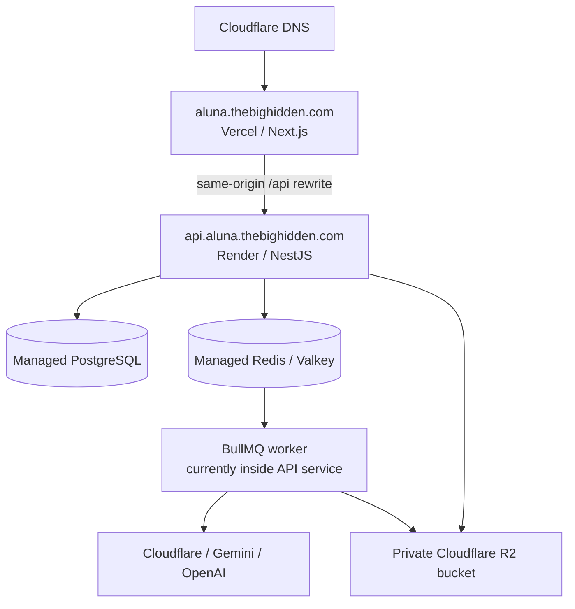

# Aluna — Deployment, accounts, secrets, and operations

This is the operational runbook for putting the complete Aluna platform online—not only the landing
page. It covers the web application, NestJS API, generation worker, PostgreSQL, Redis-compatible
queue, Cloudflare R2, AI providers, DNS, application accounts, verification, backup, and recovery.

The instructions were checked against official provider documentation on **August 6, 2026**. Hosting
plans, model IDs, quotas, and dashboard labels can change; always confirm the final values shown in
the provider dashboard.

## 1. Recommended production topology



| Component                     | Recommended service                       | Repository configuration                          |
| ----------------------------- | ----------------------------------------- | ------------------------------------------------- |
| Next.js frontend              | Vercel                                    | `apps/web/vercel.json`, `apps/web/next.config.ts` |
| NestJS API and current worker | Render web service                        | `render.yaml`                                     |
| PostgreSQL                    | Render Postgres in the same region        | `render.yaml`                                     |
| Queue                         | Render Key Value/Valkey with `noeviction` | `render.yaml`                                     |
| Product and brand assets      | Cloudflare R2                             | S3-compatible configuration in API                |
| DNS and domain                | Cloudflare DNS                            | `aluna` and `api.aluna` hostnames                 |
| Image intelligence            | Google Gemini                             | Required for multimodal product analysis          |
| Image execution               | Cloudflare, Gemini, and/or OpenAI         | Selected in Super Admin                           |

The checked-in Render topology runs the API and BullMQ processor in the same Node service. This is
acceptable for a demo and an early controlled pilot. At higher volume, split the processor into a
separate worker service so API scaling and generation concurrency can be managed independently.

Railway is an alternative for the API. `railway.json` includes build, pre-deploy migration, start,
health-check, and restart commands. Do not operate the same production queue from Render and Railway
at the same time.

## 2. Accounts you need

Use one organization-owned email address where possible, enable multi-factor authentication, and add
a recovery owner. Do not build production under a freelancer's or friend's personal account.

| Account                         | What to create                             | Owner/access                                | Secrets produced                                 |
| ------------------------------- | ------------------------------------------ | ------------------------------------------- | ------------------------------------------------ |
| GitHub                          | Repository `thebighidden/Aluna`            | Product owner plus one recovery maintainer  | Git credentials; no app secrets                  |
| Cloudflare                      | Zone for `thebighidden.com`                | Product owner                               | DNS access, Account ID                           |
| Cloudflare R2                   | Private bucket such as `aluna-production`  | Backend only                                | Access Key ID, Secret Access Key                 |
| Cloudflare Workers AI           | Restricted API token                       | Backend only                                | Account ID, Workers AI token                     |
| Vercel                          | Project for `apps/web`                     | Product owner and deployment maintainer     | No provider API keys required                    |
| Render                          | Blueprint/API service, Postgres, Key Value | Product owner and deployment maintainer     | Database/Redis URLs generated by Render          |
| Google AI Studio / Google Cloud | Dedicated Aluna project                    | Product owner                               | Gemini API key/auth key                          |
| OpenAI Platform                 | Dedicated Aluna project, optional          | Product owner                               | Project API key; optional organization admin key |
| Password manager                | Shared Aluna vault                         | Product owner plus emergency recovery owner | All account logins and recovery codes            |

Cloudflare Workers AI REST calls require an Account ID and API token. Cloudflare's official flow is
Workers AI → Use REST API → create a Workers AI token; a manually created token needs Workers AI Read
and Edit permissions. See [Cloudflare Workers AI REST API](https://developers.cloudflare.com/workers-ai/get-started/rest-api/).

Google now recommends creating keys in Google AI Studio and restricting them to the Gemini API. New
key types and migration requirements can change, so follow the current
[Gemini API-key guide](https://ai.google.dev/gemini-api/docs/api-key) and use a dedicated project.

OpenAI API keys must stay server-side. Create and manage them in the organization/project settings,
as described by the [OpenAI API authentication documentation](https://platform.openai.com/docs/api-reference/authentication).

## 3. Secrets policy

Never put real values in:

- source files;
- `render.yaml`, `vercel.json`, or `railway.json`;
- `.env.example`;
- Git commits, issues, screenshots, chat messages, or phone notes;
- any variable beginning with `NEXT_PUBLIC_`.

Use the deployment service's secret/environment-variable manager. Keep only the following memo in a
password manager:

```text
Service:
Login URL:
Owner email:
MFA method:
Recovery codes location:
Project/account ID:
Production resource names:
Billing owner:
Renewal date or plan:
Last credential rotation:
Emergency contact:
```

### Generate application secrets

Create two independent values with at least 32 random bytes. Example in PowerShell:

```powershell
[Convert]::ToBase64String((1..48 | ForEach-Object { Get-Random -Maximum 256 }))
```

Generate it twice and store the values as `JWT_ACCESS_SECRET` and `JWT_REFRESH_SECRET` in Render.
Do not reuse the Super Admin password or an AI key.

The API derives the encryption key for dashboard-saved provider credentials from
`JWT_ACCESS_SECRET`. If this secret is lost or changed, the old provider credentials in PostgreSQL
cannot be decrypted. Before rotating it, record which provider keys must be re-entered; after
rotation, re-enter or rotate those provider keys through Super Admin.

## 4. Pre-deployment checklist

1. Decide the production Git branch, normally `main`.
2. Merge only reviewed code into that branch.
3. Change the `branch` value in `render.yaml` from `codex/complete-aluna-platform` to the production
   branch if necessary.
4. Run locally:

   ```bash
   corepack enable
   pnpm install --frozen-lockfile
   docker compose up -d postgres redis
   pnpm db:generate
   pnpm --filter @product-photo/api prisma:deploy
   pnpm lint
   pnpm build
   pnpm --filter @product-photo/api test:system
   pnpm --filter @product-photo/api test:creative
   ```

5. Confirm every migration folder is committed.
6. Confirm `git status` contains no `.env`, output image, database dump, or log file.
7. Choose a new production Super Admin password of at least 16–20 random characters and store it in
   the password manager.
8. Decide the daily dollar ceiling and initial per-user limits before inviting customers.

## 5. Create Cloudflare R2 storage

The R2 bucket must be created before the API is deployed if production images need to survive service
restarts.

1. Open Cloudflare Dashboard → Storage & databases → R2 → Overview.
2. Create a private bucket, for example `aluna-production`.
3. Open **Manage API Tokens**.
4. Create an account or user R2 API token.
5. Grant **Object Read & Write** only to the Aluna bucket, not every bucket in the account.
6. Copy the Access Key ID and Secret Access Key immediately; the secret is not shown again.
7. Record the Cloudflare Account ID.
8. Do not enable a public development URL for private customer product photos.

Cloudflare documents the current process and the S3 endpoint format at
[R2 S3 API setup](https://developers.cloudflare.com/r2/get-started/s3/). Aluna uses the AWS S3 SDK
with the endpoint `https://<ACCOUNT_ID>.r2.cloudflarestorage.com` and region `auto`.

Production API variables:

```dotenv
R2_ACCOUNT_ID=<cloudflare-account-id>
R2_ACCESS_KEY_ID=<r2-access-key-id>
R2_SECRET_ACCESS_KEY=<r2-secret-access-key>
R2_BUCKET=aluna-production
R2_PUBLIC_BASE_URL=
```

Leave `R2_PUBLIC_BASE_URL` empty unless you intentionally design a public delivery layer. The current
application securely streams private objects through authenticated API endpoints.

## 6. Create AI provider credentials

### Gemini — required for intelligent product analysis

1. Create or select a dedicated Aluna project in Google AI Studio.
2. Enable billing or quota appropriate for a controlled pilot.
3. Create a Gemini API key/auth key and restrict it according to the current Google guidance.
4. Store it as `GEMINI_API_KEY` in Render, or enter it later under Super Admin → API keys.
5. Verify that the configured vision and image models are available to that project.

```dotenv
GEMINI_API_KEY=<secret>
GEMINI_VISION_MODEL=<available-vision-model>
GEMINI_IMAGE_MODEL=gemini-2.5-flash-image
```

Without a Gemini key, the application can still use fixed presets and another image provider, but
the real image-aware Product Analyst cannot run.

### Cloudflare Workers AI — recommended low-cost demo image provider

1. Open Cloudflare Dashboard → Workers AI → Use REST API.
2. Create a Workers AI API token restricted to the necessary account.
3. Copy the Account ID and token.
4. Store them in Render or the Super Admin provider vault.

```dotenv
CLOUDFLARE_ACCOUNT_ID=<account-id>
CLOUDFLARE_API_TOKEN=<secret>
CLOUDFLARE_AI_MODEL=@cf/black-forest-labs/flux-2-klein-9b
CLOUDFLARE_AI_DAILY_NEURON_BUDGET=10000
```

### OpenAI — optional alternative

1. Create a dedicated project in the OpenAI Platform.
2. Configure project billing and project-level usage limits.
3. Create a restricted project API key.
4. Store it as `OPENAI_API_KEY` in Render or the provider vault.
5. Create an organization admin key only if exact organization Usage/Costs reconciliation is needed;
   a normal generation key is safer for ordinary image calls.

```dotenv
OPENAI_API_KEY=<secret>
OPENAI_IMAGE_MODEL=gpt-image-2
OPENAI_IMAGE_QUALITY=medium
OPENAI_IMAGE_SIZE=1024x1024
OPENAI_ADMIN_KEY=
```

Provider pricing and model IDs are operational data, not permanent code facts. Confirm them in each
provider's dashboard, set provider-side spend alerts, and use Aluna's `GENERATION_DAILY_SPEND_USD`
as an additional—not sole—guard.

## 7. Deploy the API, PostgreSQL, and queue on Render

Render Blueprints use a root-level `render.yaml` to define connected services, databases, and
environment variables. See the current [Render Blueprint specification](https://render.com/docs/blueprint-spec).

### Blueprint method

1. Sign in to Render and connect the GitHub repository.
2. Open **Blueprints** and create a Blueprint from `thebighidden/Aluna`.
3. Select the production branch and root `render.yaml`.
4. Review the three resources before applying:
   - `aluna-api` web service;
   - `aluna-postgres` PostgreSQL 16 database;
   - `aluna-redis` Key Value service with `noeviction`.
5. Supply every variable marked `sync: false`.

Required values:

```dotenv
NODE_ENV=production
CORS_ORIGINS=https://aluna.thebighidden.com
GENERATION_PROVIDER=gemini
GENERATION_DAILY_SPEND_USD=<your-safe-daily-limit>
JWT_ACCESS_SECRET=<random-secret-one>
JWT_REFRESH_SECRET=<random-secret-two>
BOOTSTRAP_ADMIN_EMAIL=<private-owner-email>
BOOTSTRAP_ADMIN_PASSWORD=<unique-password-manager-password>
BOOTSTRAP_ADMIN_NAME=<display-name>

# plus R2 and the selected AI provider variables
```

`DATABASE_URL` and `REDIS_URL` are wired from the Blueprint resources. Do not manually replace them
with localhost values.

6. Apply the Blueprint.
7. Watch the build log. It installs the workspace, generates Prisma, builds NestJS, applies checked-in
   migrations, then starts the API.
8. Confirm Render health is green and open:

   ```text
   https://<render-service>.onrender.com/health
   ```

   Expected shape:

   ```json
   { "status": "ok", "database": "connected", "timestamp": "..." }
   ```

9. Inspect the first startup log for configuration or migration errors.

Render documents that Node web services must use the supplied `PORT`, can connect to Postgres and
Key Value over the private network, and receive TLS at the load balancer. See
[Render web services](https://render.com/docs/web-services).

### Plan warning

The checked-in Blueprint currently names free plans. Those are for acceptance testing only. Render's
current documentation states that free PostgreSQL expires after 30 days, free Key Value has no
persistence, and database recovery/backups require paid PostgreSQL. For any real customer data:

- use a persistent paid PostgreSQL plan with backups;
- use a persistent Key Value plan for the job queue;
- use an API service that does not sleep during active customer testing;
- select the same region for API, PostgreSQL, and Key Value.

See [Render service types](https://render.com/docs/service-types),
[Render Key Value persistence](https://render.com/docs/key-value), and
[Render PostgreSQL recovery](https://render.com/docs/postgresql-backups).

## 8. Configure the API custom domain

1. In the Render `aluna-api` service, open Settings → Custom Domains.
2. Add `api.aluna.thebighidden.com`.
3. Render will show the exact DNS target and any verification record.
4. In Cloudflare DNS, create the record exactly as Render requests. Begin with **DNS only** while
   ownership and TLS are verified.
5. Remove conflicting A, AAAA, or CNAME records for the same hostname.
6. Return to Render and click Verify.
7. Test `https://api.aluna.thebighidden.com/health`.

Render's current three-stage flow is add domain, configure DNS, then verify; it provisions and renews
TLS automatically. See [Render custom domains](https://render.com/docs/custom-domains).

Do not point `api` at the Vercel frontend and do not point `aluna` at the API.

## 9. Deploy the Next.js frontend on Vercel

1. Sign in to Vercel and import the same GitHub repository.
2. Select the Next.js application under `apps/web` as the project Root Directory.
3. Keep pnpm as the package manager; Vercel should use the root workspace lockfile.
4. If the Vercel project cannot access the root lockfile/workspace files, enable inclusion of source
   files outside the selected Root Directory as described in Vercel's
   [monorepo documentation](https://vercel.com/docs/monorepos).
5. Set the Production Branch to the same branch deployed by Render.
6. Add production variables:

   ```dotenv
   ALUNA_API_ORIGIN=https://api.aluna.thebighidden.com
   NEXT_PUBLIC_APP_URL=https://aluna.thebighidden.com
   ```

7. Do not set `NEXT_PUBLIC_API_URL` in production. Its absence makes the browser use same-origin
   `/api`, and the private rewrite uses `ALUNA_API_ORIGIN`.
8. Deploy and test the generated `*.vercel.app` URL first.
9. Remember that changing a Vercel environment variable affects only new deployments; redeploy after
   changes. See [Vercel environment variables](https://vercel.com/docs/environment-variables).

## 10. Configure the frontend domain in Cloudflare DNS

1. In Vercel, open Project → Settings → Domains.
2. Add `aluna.thebighidden.com`.
3. Use the exact CNAME/TXT values Vercel displays; provider values can change.
4. In Cloudflare DNS, remove any old Tunnel or localhost-related record for `aluna`.
5. Create the requested records, initially DNS only if verification fails through the proxy.
6. Return to Vercel and verify the domain and TLS certificate.

Vercel's current custom-domain flow and verification commands are documented at
[Vercel custom domains](https://vercel.com/docs/domains/set-up-custom-domain). Cloudflare documents
creating a CNAME from a subdomain to a provider hostname at
[Cloudflare subdomain records](https://developers.cloudflare.com/dns/manage-dns-records/how-to/create-subdomain/).

The correct final relationship is:

| Public hostname              | Destination             |
| ---------------------------- | ----------------------- |
| `aluna.thebighidden.com`     | Vercel frontend project |
| `api.aluna.thebighidden.com` | Render NestJS API       |

Buying a domain does not host the application. DNS only tells visitors where the already-running
frontend and backend live. If Docker must remain running on the development computer, the hostname
still points to a local tunnel—not a production deployment.

## 11. Application accounts

### Super Admin

There must be exactly one `SUPER_ADMIN`. On the first production API startup, it is created from:

```dotenv
BOOTSTRAP_ADMIN_EMAIL=
BOOTSTRAP_ADMIN_PASSWORD=
BOOTSTRAP_ADMIN_NAME=
```

The bootstrap variables do not overwrite an existing Super Admin on future deployments. Store the
login in the password manager, not in this repository. The Super Admin signs in at:

```text
https://aluna.thebighidden.com/admin/login
```

There is currently no completed email-based password-recovery service. Protect this credential and
define a supervised database recovery procedure before launch.

### Studio users

The Super Admin creates each customer in Admin → Users. A customer is a single `USER` account and
receives:

- name and unique email;
- initial password;
- active/inactive state;
- optional timed ban and reason;
- hourly and daily request limits;
- maximum images per request;
- maximum concurrent requests.

Customers sign in at:

```text
https://aluna.thebighidden.com/studio/login
```

Send the initial password through a secure one-time channel and require an agreed reset process. Do
not maintain a spreadsheet or phone note containing every customer's password. Administrators can
set a new password but cannot read the existing bcrypt hash as plaintext.

Local demo credentials from development must never be reused in production. `NODE_ENV=production`
requires explicit bootstrap admin variables and does not create the local demo account automatically.

## 12. First production verification

Perform the checks in this order so failures are easy to locate.

### Infrastructure

```text
1. Render API deploy is green.
2. /health returns 200 and database connected.
3. PostgreSQL migration log has no error.
4. Key Value connection is healthy in Admin.
5. Admin reports Cloudflare R2, not Local disk.
6. Frontend Vercel deployment is green.
7. Both custom domains have valid HTTPS.
```

### Authentication and permissions

1. Sign in as Super Admin.
2. Confirm `/admin`, `/admin/users`, `/admin/system`, and `/admin/api-keys` survive a hard refresh.
3. Create one temporary Studio user with very small limits.
4. Confirm the Studio user cannot access `/admin` or another customer's operations.
5. Sign in again in a second browser and confirm the first session is revoked.

### Intelligence and generation

1. Upload a non-sensitive product photograph.
2. Run Product Analysis and confirm Gemini returns attributes and six sensible scenes.
3. Save a Brand Profile and verify the Creative Director shows its version.
4. Generate exactly one image with the cheapest enabled provider.
5. Confirm queued → analyzing → generating → done.
6. Refresh the page and confirm the campaign and protected image remain available.
7. Confirm the operation appears in Admin with provider, model, source, output, duration, usage, and
   estimated cost.
8. Test one intentionally invalid upload and one account-limit rejection.
9. Delete the temporary account only after verifying that the generation audit remains.

## 13. Deploying updates

Normal release flow:

1. Make and review changes on a branch.
2. Run lint, build, and both smoke suites.
3. If the schema changed, review and commit the migration.
4. Back up production before a risky migration.
5. Merge to the configured production branch.
6. Render deploys the API and applies `prisma migrate deploy` before start.
7. Vercel deploys the web application.
8. Check `/health`, then perform a login and one no-cost admin read.
9. For an AI or storage change, run one controlled end-to-end image.
10. Monitor error rate, queue, spend, and provider usage after release.

Never manually edit a production table to “match” code without a checked-in migration.

## 14. Backups and recovery

### PostgreSQL

- Use a plan with provider-managed recovery.
- Schedule regular logical exports for independent long-term retention.
- Encrypt backup files and restrict their storage account.
- Test restoring into a new empty database; an untested backup is not a recovery plan.
- Record recovery time objective and maximum acceptable data loss.

### R2

- Use a dedicated production bucket and restricted token.
- Define lifecycle rules only after agreeing how long customer sources and outputs must be retained.
- Do not delete a bucket during a routine application redeploy.
- Consider object versioning or an export process for high-value campaigns.

### Redis/Valkey

PostgreSQL is the permanent generation record, but loss of the queue can strand queued work. Use a
persistent queue plan, `noeviction`, and operational reconciliation for generation records stuck in
QUEUED/ANALYZING/GENERATING after an incident.

### Provider credentials

Keep a provider-by-provider rotation checklist. When a key is suspected to be exposed:

1. revoke it at the provider immediately;
2. create a new restricted key;
3. update Render or the Admin provider vault;
4. redeploy if the value is environment-based;
5. test configuration without printing the secret;
6. inspect provider usage and billing for abuse.

## 15. Common failures

### The domain works only while Docker is running

DNS is pointing to a local machine/tunnel. Point `aluna` to Vercel and `api` to Render, then verify
both custom domains.

### `fetch failed` or “Could not reach the Aluna API”

Check, in order:

1. `https://api.aluna.thebighidden.com/health`;
2. Render deploy and runtime logs;
3. `ALUNA_API_ORIGIN` in Vercel Production;
4. a new Vercel deployment after changing the variable;
5. API custom-domain DNS/TLS;
6. `CORS_ORIGINS` if the browser is calling the API directly instead of `/api`.

### API health fails

Inspect `DATABASE_URL`, migration output, database availability, `PORT`, and service logs. A healthy
Nest process without a working database intentionally fails `/health`.

### Jobs stay queued

Inspect Redis/Key Value connection, queue health, worker count, `noeviction`, memory, and service
restarts. The current worker is inside the API service, so a sleeping or failed API also stops work.

### Images disappear after a redeploy

Admin probably reports `Local disk`. Complete all four R2 variables; partial R2 configuration falls
back to ephemeral local storage by design.

### Product Analysis asks for Gemini

Add a valid Gemini key in Render or Super Admin → API keys and verify the configured vision-model ID
is available in the Google project.

### Provider says billing limit, quota, or daily budget

Check both the provider dashboard and Aluna Admin → Usage/System. Aluna's costs are estimates unless
connected to a provider reconciliation API. Increase a limit only after confirming expected traffic
and setting a deliberate budget.

### Content-policy failure

Try a clearer product-only source and a safer commercial direction. Do not silently bypass provider
safety systems. Preserve the classified failure in the generation audit.

## 16. Launch sign-off

Do not give the domain to external testers until all items are true:

- [ ] Vercel and Render deploy from the intended production branch.
- [ ] The API health check is public and green.
- [ ] PostgreSQL and Key Value are persistent plans appropriate for the test.
- [ ] Admin reports Cloudflare R2 storage.
- [ ] Gemini Product Analysis works.
- [ ] At least one image provider works with a one-image request.
- [ ] Daily provider-side and Aluna-side budgets are set.
- [ ] The Super Admin credential and platform recovery codes are in the password manager.
- [ ] No local demo password is valid in production.
- [ ] CORS contains only intended production/preview origins.
- [ ] User isolation and Super Admin authorization were tested.
- [ ] Database backup and restore ownership is assigned.
- [ ] Privacy, acceptable-use, retention, and consent rules are ready for testers.
- [ ] Monitoring responsibility is assigned for queue, errors, storage, and spend.
